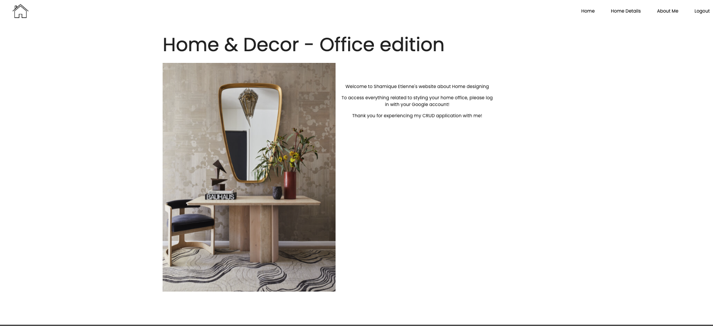
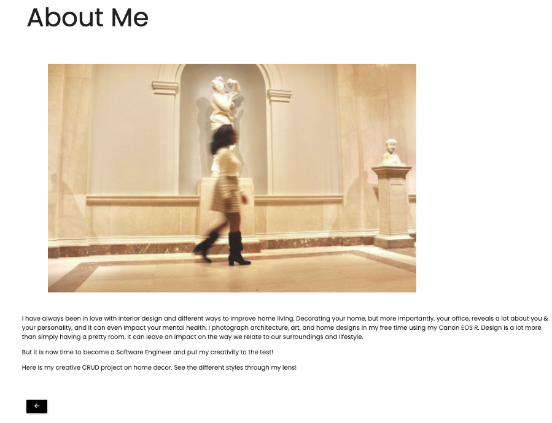
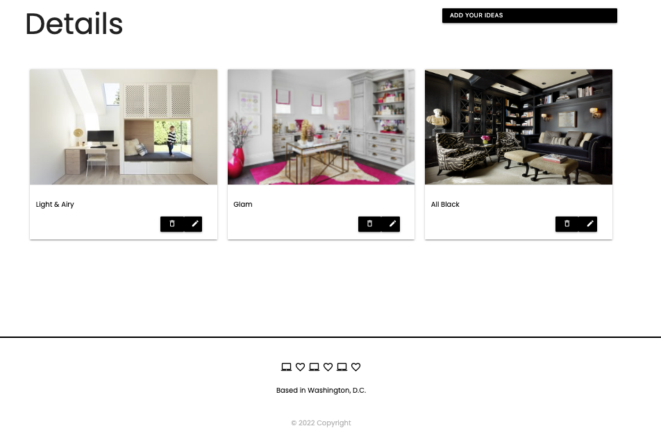

# Interior Design by Shamique Etienne

## Introduction:
My interior design project is a full-stack CRUD application based on designing a client's home office. I chose it due to my love for home styling and interior design. It consists of a homepage, an about me section, and the ability for clients to post a perfectly styled office to their liking. Clients are then able to edit their forms and update their photos to another photo of their choice. In order to access the viewpage, clients must sign in using their google accounts. 

## Screenshots:

## Technologies Used: 
- Node.js
- Express
- MongoDB
- Google OAuth Authentication
- Bootstrap 
- Materialize CSS

## Getting Started: 
[Interior Design by Shamique](https://shamiquesinterior.herokuapp.com/)

[Trello](https://trello.com/b/knucUAMH/project-two)

[Wireframe](https://whimsical.com/project-two-J8APrixYytVBQPUKyRJRJU)

## Next Steps: 
- As a user, I want to like other's photos
- As a user, I want to comments on other's photos
- As a user, I want to post videos

